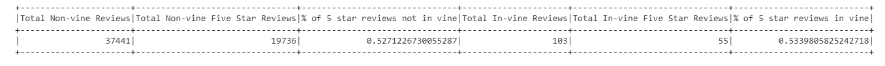

# Amazon Vine Analysis

## Purpose

Using `Pyspark`, a `PostgreSQL` server on `AWS`, and `Google Colab`, a comparision of product reviews made through the Amazon Vine product review program was conducted. The purpose of the comparison was to look for evidence of positivity bias in vine-based reviews, versus non-vine reviews.

## Data

Data was available by product category, as provided by Amazon [here](https://s3.amazonaws.com/amazon-reviews-pds/tsv/index.txt).
The above data sets includes both vine and non-vine product reviews. 

## Analysis

For this analysis, the [*gift cards*](https://s3.amazonaws.com/amazon-reviews-pds/tsv/amazon_reviews_us_Gift_Card_v1_00.tsv.gz
) category was analysed. After completing the analysis however, it was determined that no vine ratings were assigned to gift cards, so a subsequent analysis was completed on the [*outdoor product*](https://s3.amazonaws.com/amazon-reviews-pds/tsv/amazon_reviews_us_Outdoors_v1_00.tsv.gz) *category*.

The procedure for both analyses was as follows:
1. Download data from the s3 site.
2. Create a data frame containing the following data points: **review_id, star_rating, helpful_votes, total_votes, vine, verified_purchase**
3. Limit the dataset to reviews with:
   - Greater than 20 total votes (**total_votes** column)
   - Helpful votes being 50% or more of total votes (**helpful_votes**/**total_votes** >= 50%)
4. Segment data to compare the number of 5-star (**star_rating**) ratings produced by reviewers participating in the vine program (**vine**) versus reviewers not participating in the program.  

## Results

### Gift Cards
As noted, and shown immediately below, gift cards received no vine reviews, and a total of **340** non-vine reviews.  The proportion of 5-star reviews in the non-vine dataset was approximately 26%:

### Outdoor Products
Outdoor products, however, did have both vine and non-vine reviews.
Non-vine reviews totalled **37,441**, *53%* of which (**19,736**) were 5-star ratings.  Vine reviews totalled **103**, *53%* of which (**55**) were 5-star ratings.

Given the equal distribution of 5-star ratings between both samples, we find **no evidence of bias** towards positivity in vine based ratings for outdoor products.

## Additional Analyses
A test of the statistical significance of the proportion of 5 star-ratings in vine and non-vine reviews should be conducted to confirm the veracity of the results.  The test could use the following null and alternative hypotheses.

$$H_0: \text{The proportion of vine 5-star reviews} =  \text{proportion of non-vine 5-star reviews (in this case 53\%) }$$

$$H_1: \text{The proportion of vine 5-star reviews} \neq \text{proportion of non-vine 5 star reviews}$$

